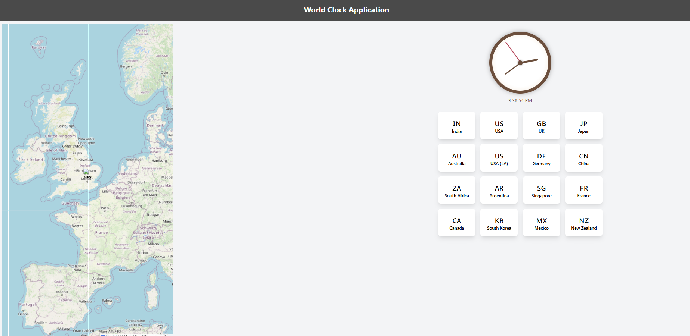

# World Clock App



## Overview

The World Clock App is a web application that displays a 4x4 grid of flags and country names. Each country button updates the clock time to match the corresponding timezone. The application features a responsive design with an interactive world map that highlights the timezone of the selected country. This project is built using React.js, Tailwind CSS, and deployed on GitHub Pages.

## Features

- **Responsive Design:** Displays a 4x4 grid of flags and country names with an interactive world map.
- **Timezone Highlighting:** Hover over flags to highlight the corresponding timezone on the map.
- **Clock Display:** Shows the current time for the selected timezone.
- **Deployment:** Hosted on GitHub Pages.

## Technologies Used

- **React.js:** Frontend library for building user interfaces.
- **Tailwind CSS:** Utility-first CSS framework for styling.
- **Leaflet and Mapbox GL:** Libraries for interactive maps.
- **GitHub Pages:** Hosting platform for deploying static sites.

## Project Structure

- `src/` - Contains all the source code for the application.
  - `components/` - React components for various parts of the app.
  - `App.js` - Main application component.
  - `index.js` - Entry point for React.
  - `App.css` - Styles for the application.
- `public/` - Public assets such as the HTML file and static assets.
- `package.json` - Project metadata and dependencies.
- `.github/` - GitHub workflows and configurations.
  - `workflows/` - Contains GitHub Actions workflows for CI/CD.

## Setup Instructions

### Prerequisites

Ensure you have the following installed on your local machine:
- [Node.js](https://nodejs.org/) (v16 or later)
- [npm](https://www.npmjs.com/) (comes with Node.js)

### Installation

1. **Clone the Repository:**

   ```bash
   
   git clone https://github.com/goutamhegde002/World-Clock-App.git
   cd World-Clock-App
   
2. **Install Dependencies:**

      ```bash
        npm install
      ```

 3. **Start the Development Server:**

      ```bash
      npm start
      ```

    Open http://localhost:3000 in your browser to view the application.

## **Usage**

  Interact with the Grid: Click on any flag in the 4x4 grid to update the clock with the corresponding timezone.
  
  Hover Over Flags: Hovering over a flag highlights the timezone on the world map and updates the clock to display the current time for that timezone.
  
## **Deployment**

  The project is deployed using GitHub Pages. To deploy your changes:

   1. Build the Project:
       ```
          npm run build
       ```
   2. Deploy to GitHub Pages:
  
      ```
          npm run deploy
      ```

  Ensure that you have set up the gh-pages branch and configured your GitHub Actions workflow correctly.

## **License**

  This project is licensed under the Apache License - see the LICENSE file for details.

## **Acknowledgments**

  React.js - Library for building the user interface.
  
  Tailwind CSS - Utility-first CSS framework.
  
  Leaflet and Mapbox GL - Libraries for interactive maps.

